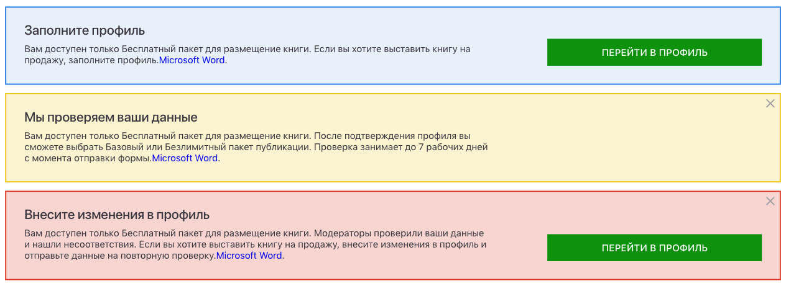

# InfoBox Component

Using for show status and notifications



```jsx
<ThemeProviderWrapper>
  <Fragment>
    <InfoBox
      header={"Заполните профиль"}
      show={boolean("open", false)}
      variation="info"
      actionText="Перейти в профиль"
    >
      <Fragment>
        Вам доступен только Бесплатный пакет для размещение книги. Если вы
        хотите выставить книгу на продажу, заполните профиль.
        <a href="#some-hash">Microsoft Word</a>.
      </Fragment>
    </InfoBox>
    <InfoBox
      header={"Мы проверяем ваши данные"}
      show={boolean("open", false)}
      variation="warn"
      closeButton
    >
      <Fragment>
        Вам доступен только Бесплатный пакет для размещение книги. После
        подтверждения профиля вы сможете выбрать Базовый или Безлимитный
        пакет публикации. Проверка занимает до 7 рабочих дней с момента
        отправки формы.
        <a href="#some-hash">Microsoft Word</a>.
      </Fragment>
    </InfoBox>
    <InfoBox
      header={"Внесите изменения в профиль"}
      show={boolean("open", false)}
      variation="error"
      actionText="Перейти в профиль"
      closeButton
    >
      <Fragment>
        Вам доступен только Бесплатный пакет для размещение книги.
        Модераторы проверили ваши данные и нашли несоответствия. Если вы
        хотите выставить книгу на продажу, внесите изменения в профиль и
        отправьте данные на повторную проверку.
        <a href="#some-hash">Microsoft Word</a>.
      </Fragment>
    </InfoBox>
  </Fragment>
</ThemeProviderWrapper>
```
