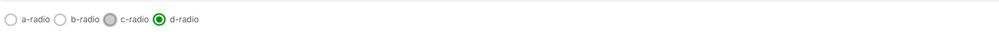

# Radio Component

Using for radio button control



```jsx
<ThemeProviderWrapper>
    <RadioGroup
      onChange={rest => console.log("change radio value", rest)}
      id="test"
    >
      <Radio value="a">a-radio</Radio>
      <Radio value="b">b-radio</Radio>
      <Radio value="c" disabled>
        c-radio
      </Radio>
      <Radio value="d">d-radio</Radio>
    </RadioGroup>
</ThemeProviderWrapper>
```
