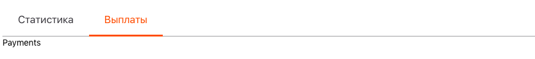

# Tabs and Tab component



A component of navigation in the form of tabs. Usually used in conjunction with `<Tab/>`.

## Common usage

```jsx harmony
import React from "react";
import { Tabs, Tab } from "@selfpub/selfpub-ui";

<Tabs defaultActiveTabIndex={1} onChangeTab={onChange}>
    <Tab
      label="Статистика"
      name="statistics"
      onClick={onClickAction}
    >
        Statistic
    </Tab>
    <Tab
      label="Выплаты"
      name="payments"
      onClick={onClickAction)}
    >
        Payments
    </Tab>
</Tabs>
```

## Routing by url

In component using tab routing by url. For target active tab may be used get param `currentTab`. For url `mysite.info/?currentTab=payments` be opened on load page tab with name `payments`.

## PropTypes

### "Tab" Component

| property  | propType          | required | default | description                      |
| --------- | ----------------- | -------- | ------- | -------------------------------- |
| label     | string or element | yes      | -       | Label for tab                    | 
| tabIndex  | number            | -        | -       | Index current tab in stack(Tabs) |
| isActive  | bool              | -        | null    | Flag for active tab              |
| onClick   | func              | -        | null    | Callback calls on label click    |
| name      | string            | yes      | -       | Name of tab need for routing     |


### "Tabs" Component

| property              | propType                  | required | default | description                                      |
| --------------------- | ------------------------- | -------- | ------- | ------------------------------------------------ |
| wrapped               | bool                      | -        | null    | flag for wrap tab content in component Container |
| children              | string or element or node | yes      | -       | Tabs content elements                            |
| defaultActiveTabIndex | number                    | -        | 0       | Used for open tabs by number onMount             |
| onChangeTab           | func                      | -        | null    | Callback calls on change tab                     |
